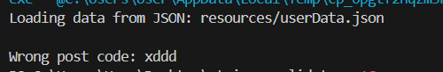
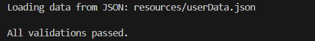
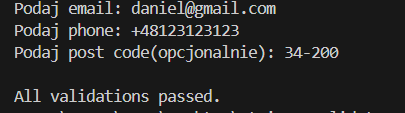
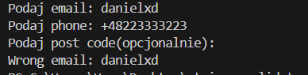

# Personal Data Validator


### Treść Zadania
  Zadaniem jest stworzenie aplikacji, która waliduje dane tekstowe (np. e-maile i numery telefonów) wprowadzane ręcznie z klawiatury lub z pliku  JSON   Wzorzec Łańcuch Odpowiedzialności będzie używany do etapowej walidacji danych, a wzorzec Fabryka będzie odpowiedzialny za dynamiczne  tworzenie   walidatorów danych. Aplikacja powinna obsługiwać wyjątki oraz wykorzystywać kolekcje generyczne do zarządzania różnymi typami danych.


<details>
  <summary> Szczegóły </summary>

  **Wzorce projektowe:**
  - Łańcuch Odpowiedzialności: Walidacja danych krok po kroku (np. najpierw e-mail, potem numer telefonu).
  - Fabryka: Dynamiczne tworzenie walidatorów danych (np. dla e-maila lub numeru telefonu).

  **Wejście:**
  - Dane tekstowe (np. e-mail, numer telefonu) wprowadzane ręcznie z klawiatury lub { "email": "user@example.com", "phone": "+1234567890" }
  - Klawiatura: Wprowadzanie danych ręcznie.

  **Wyjście:**
  - Komunikat o poprawnej walidacji lub błędach walidacyjnych (np. niepoprawny format e-maila).

  **Zakres danych:**
  - Dane tekstowe: e-mail, numer telefonu.
  - Walidacja: poprawność formatu e-maila i numeru telefonu.

  **Oczekiwane działanie:**
  - Aplikacja powinna dynamicznie tworzyć walidatory i przeprowadzać walidację danych za pomocą Łańcucha Odpowiedzialności.
  - Obsługa wyjątków powinna zwracać komunikaty o błędach w przypadku niepoprawnych danych.

  **Techniki Java:**
  - Mechanizm wyjątków: Obsługa błędów walidacyjnych.
  - Kolekcje generyczne: Zarządzanie różnymi typami danych (e-mail, numer telefonu).

  **Zadania rozszerzające:**
  - Rozbudowa walidacji: Dodanie walidacji dodatkowych danych, takich jak adresy pocztowe.
  - Obsługa JSON w różnych formatach: Dodanie obsługi walidacji danych z JSON o różnych strukturach.

</details>

### Opis Implementacji

W Projekcie do Walidacji zastosowane zostały trzy wzorce projektowe.

##### Strategia
Klasy **StrategyConsoleLoad** oraz **StrategyJsonLoad**  zostały zaprojektowane zgodnie z wzorcem Strategia. Ładowanie danych odbywa wedlug strategii określonych w klasach implementujących interface **IStrategyDataLoad**.

##### Łańcuch Odpowiedzialnośći
W moim projekcie łańcuch odpwoiedzialności został delikatnie zmodyfikowani i różni się troche od przedstawionego na zajęciach. Na zajęciach bardzo przeszkadzało mi, że ostatnie ogniow łańcucha musi być modyfikowane zależnie od tego czy jest ostatnie. Kod z zajęc:
```java
class HighLevelHandler extends Handler {
    @Override
    void handleRequest(int level) {
        if (level == 3) {
            System.out.println("HighLevelHandler handled level 3 request.");
        } else {
            System.out.println("Unhandled request.");
        }
    }
}
```

Ogniwa które ja zaprojektowalem Zakładają, że zawsze będzie istniało tak zwane ostatnie ogniwo **FinalValidator**, dzięki temu, nie muszę zmieniać kodu w momencie w którym ostatnie ogniwo przestaje być ostatnim. Dodatkowo, dzięki temu, że zakłądam że zawsze będzie istniało kolejne ogniwo(**FinalValidator**), nie muszę sprawdzać czy *nextValidator == null*

```java

class PostCodeValidator extends AbstractValidator {

    private static final Pattern POST_CODE_PATTERN = Pattern.compile("^\\\\d{5}(-\\\\d{4})?$");
    
    @Override
    public void validate(UserDTO user) throws ValidationException{
        String postCode = user.postCode();
        System.out.println();
        //Post Code is Optional
        if (!POST_CODE_PATTERN.matcher(postCode).matches()) {
            throw new ValidationException("Wrong post code: " + postCode);
        }

        this.nextValidator.validate(user);
    }
}
class FinalValidator extends AbstractValidator {

    @Override
    public void validate(UserDTO user) throws ValidationException{
        if (this.nextValidator != null){
            throw new ValidationException("Final validator should be last validator");
        }
        System.err.println("All validations passed.");
    }
}

```

Minusem tego podejscia jest, to że trzeba pamietać o tym, aby finalValidator był tym ostatnim. Ale dzięki temu ze konstruktorów Validatorów jest dostep tylko z poziomu pakietu (package protected) Można stworzyć Bulider,który zawsze dodaje FinalValidator na koniec Łancucha.


##### Factory
W Projekcie zaimplementowałem FaktoryMethod która dynamicznie Tworzy dany validator na podstawie nazwy kalsy, Validatory są rejestrowane w bloku statycznym, dzięki temu dodawanie walidatorów jest dosyc proste.

```java
    static {
        VALIDATORS_MAP.put("email", EmailValidator.class);
        VALIDATORS_MAP.put("phone", PhoneValidator.class);
        VALIDATORS_MAP.put("postcode", PostCodeValidator.class);
        VALIDATORS_MAP.put("final", FinalValidator.class);
    }
```

##### Wyjątki i typy Generyczne
W projekcie zastosowałem własne wyjątki oraz mechanizmy przechwytywania i wywoływania własnych wyjątków.
Jeżeli chodzio Generyczność walidatorów, uznałem, że lepszym podejściem będize przechowywanie danych w klasie UserDTO
Typy Generyczne są wykorzystane do przechowywania klas w factory method:
```java
private static final HashMap<String, Class<? extends AbstractValidator>> VALIDATORS_MAP = new HashMap<>
```

### Wynik Działania

**Przykladowe dane json:**
```json
{
    "email": "daniel@gmail.com",
    "phone": "+1234567890",
    "post_code" : "xddd"
}
{
    "post_code": "34-333",
    "contact": {
        "email": "daniel@gmail.com",
        "phone": "+48123123123"
    }
}
```

**Wynik:**




